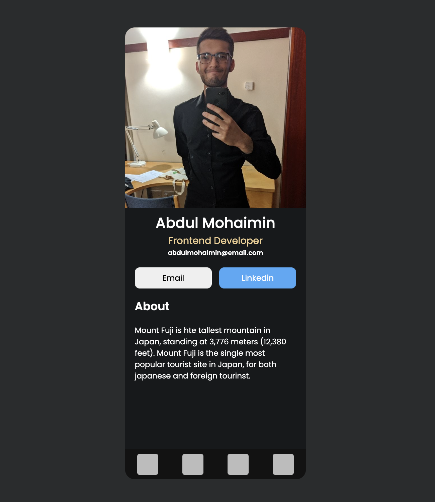
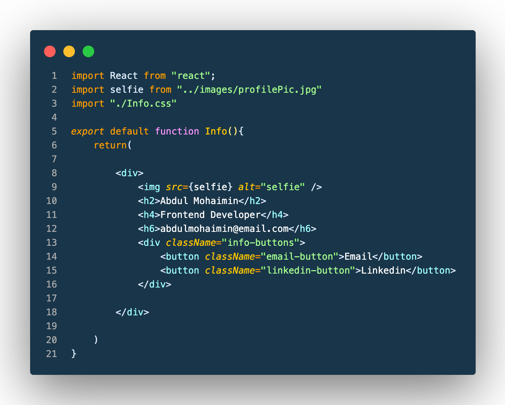
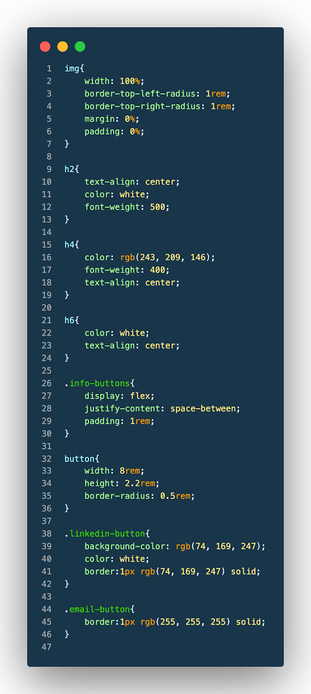

# Digital Business Card

## Brief
This is a static react project built independently from a refrence image.

## Screenshot

As mentioned before this project was made from a reference image, however coding this project was a fully individual task.

## Project outline
This project has 4 main components. The  Info, About, Footer and App components. For the sake of brevity I will only detail the Info component. The screenshot for the Info component is shown below.

In this component I had to learn how to implement images in react. Using images in JSX is different to using images in HTML. First you need to import images into your component. Then to use the imported  image you will need to define the import inside an image tag using braces.
To style info buttons I had to learn how to use flex box to arrange the buttons horizontally.The styling for the component above is shown below

## Conclusion

In this project I learned how to create static pages using react. I learned how to use JSX and then how to use css to style the elements and I learned how to bring multiple custom components together and display them on a single page.
